# RSA Lab by Ahmed Bakr

## How to Run

The compilation of this code utilizes the `MakeFile`. To run, open the terminal in this directory as the root directory and type `make`.

After the command finishes the target binary outputs will exist in `outputs` folder. There will exist one binary file for each task. For example, the output binrary file for the first task is `outputs/task1`, and so on.
To run the code from the first task, type the following in the command line: `make run_task1`.
Replace `1` in the previous command by any number from `1` to `6` to get the output for that task.

## Task 1 (Deriving the private key)

The code for this task can be found inside `task1.c` file.
The code is self explanatory and is full with comments to describe every step done.
However, I will emphasize on the verification of `d`, where it can be verified by confirming that `d * e mod phi_n == 1`, as shown in the output from running the program below.
It is also worth mentioning that to run this task, open the terminal and write `make run_task1`.

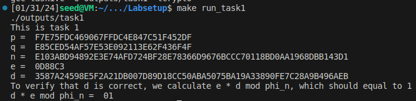

The important code snippet for this task is shown below:

```python
    BN_hex2bn(&p, "F7E75FDC469067FFDC4E847C51F452DF"); // big prime number
    BN_hex2bn(&q, "E85CED54AF57E53E092113E62F436F4F"); // big prime number
    BN_hex2bn(&e, "0D88C3");

    // n = p * q
    BN_mul(n, p, q, ctx);
    
    // p_minus_1 = p - 1
    p_minus_1 = BN_dup(p);
    BN_sub(p_minus_1, p_minus_1, BN_value_one());

    // q_minus_1 = q - 1
    q_minus_1 = BN_dup(q);
    BN_sub(q_minus_1, q_minus_1, BN_value_one());

    // phi_n = (p - 1) * (q - 1)
    BN_mul(phi_n, p_minus_1, q_minus_1, ctx);

    // d = e^-1 mod phi_n
    BN_mod_inverse(d, e, phi_n, ctx);
```

## Task 2 (Encrypting a Message)

The code for this task can be found inside `task2.c` file.
The hex value of the message: `AhmedBakr-12290214` is converted via the website as shown in the attached image below.

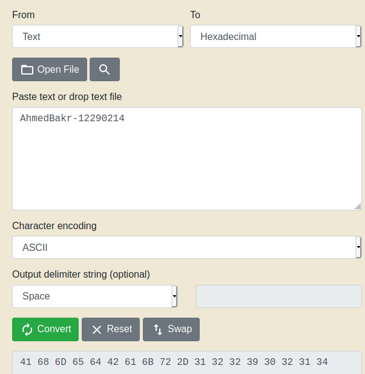

The output hex value is the encoded message, as shown in line 31 in the code.
It is also worth mentioning that to run this task, open the terminal and write `make run_task2`.
The output after executing the program is:

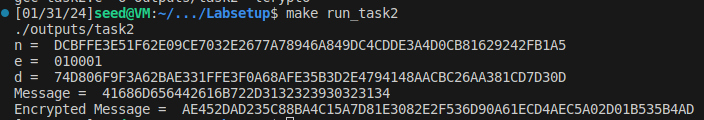

The important code snippet for this task is shown below:

```python
BN_hex2bn(&n, "DCBFFE3E51F62E09CE7032E2677A78946A849DC4CDDE3A4D0CB81629242FB1A5"); // This is the public modulus (part of the public key)
BN_hex2bn(&e, "010001"); // This is the public exponent (the other part of the public key)
BN_hex2bn(&d, "74D806F9F3A62BAE331FFE3F0A68AFE35B3D2E4794148AACBC26AA381CD7D30D"); // The private key
BN_hex2bn(&M, "41686D656442616B722D3132323930323134"); // This is the hex value of the message "AhmedBakr-12290214"

// C = M^e mod n
BN_mod_exp(C, M, e, n, ctx); // The cipher text is stored in C
```

## Task 3 (Decrypting a Message)

The code for this task can be found inside `task3.c` file.
The hex value of the ciphertext (encrypted message) is given as an input from the previous task.
The output of the program is shown in the following screenshot.

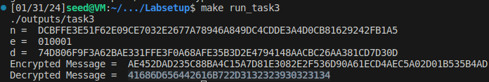

The output of decryption message (the output hex) is translated back to ascii as shown in the following image that proves that we were able to retrieve the original message from task 2.

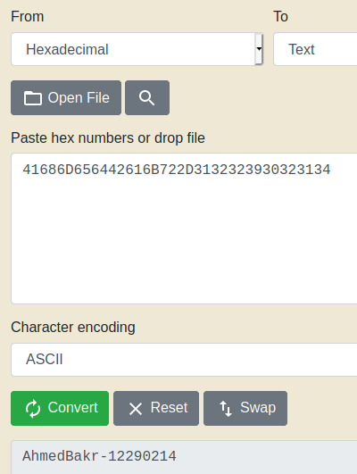

The important code snippet for this task is shown below:

```python
BN_hex2bn(&n, "DCBFFE3E51F62E09CE7032E2677A78946A849DC4CDDE3A4D0CB81629242FB1A5"); // This is the public modulus (part of the public key)
BN_hex2bn(&e, "010001"); // This is the public exponent (the other part of the public key)
BN_hex2bn(&d, "74D806F9F3A62BAE331FFE3F0A68AFE35B3D2E4794148AACBC26AA381CD7D30D"); // The private key d
BN_hex2bn(&C, "AE452DAD235C88BA4C15A7D81E3082E2F536D90A61ECD4AEC5A02D01B535B4AD"); // This is the encryption value from the previous task 2

// decrypted_M = C^d mod n
BN_mod_exp(decrypted_M, C, d, n, ctx); // The decrypted text is stored in decrypted_M
```

## Task 4 (Signing a Message)

The code for this task can be found inside `task4.c` file.
Kindly note that there are 2 input messages in this task.
The first is `AhmedBakr-12290214 owes you $2000.` and the second is `AhmedBakr-12290214 owes you $3000.`.
The only difference is that we changed the owed amount (only one character in the text).
This is to check the effect of changing one character in the text on the output signature.
As shown in the attached output below that one change in the signed message resulted in a defused change in the signature, which is a great property and it proves that no one can forge the signature of someone on a new message by combining pieces from old messages/signatures pairs.

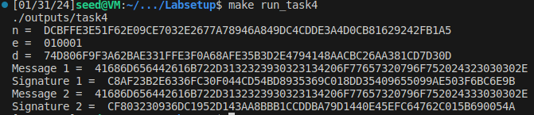

The important code snippet for this task is shown in the image below:

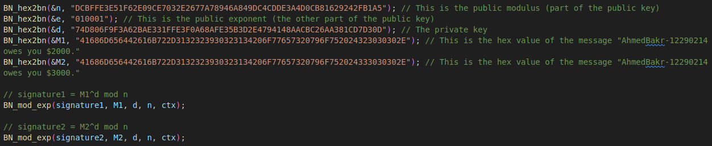

## Task 5 (Verifying a Signature)

The code for this task can be found inside `task5.c` file.
This example shows that a valid signature can be validated successfully, as shown in the first authentic signature resulted in the text: `valid signature`, while a slight change (even one bit change) will result in an `invalid signature` output, as shown in the image below.

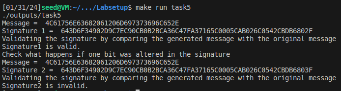

The important code snippet for this task is shown in the image below:

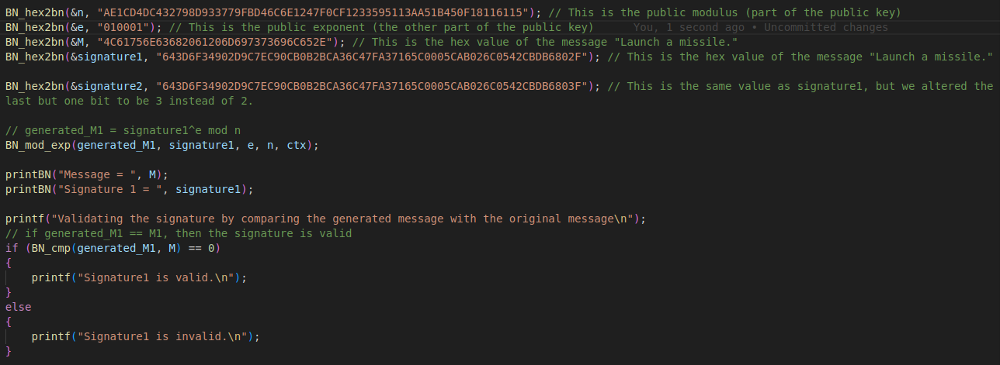

## Task 6 (Download a certificate from a real web server)

Following the instructions in the lab, I downloaded two certificates for `github` as shown in the attached images below. In addition, this certificate was issued by `DigiCert`, which is the line that starts with `i:`.
The first printed certificate belongs to `github` and the second certificate belongs to the root CA that issued this certificate for `github`, i.e., `DigiCert`.

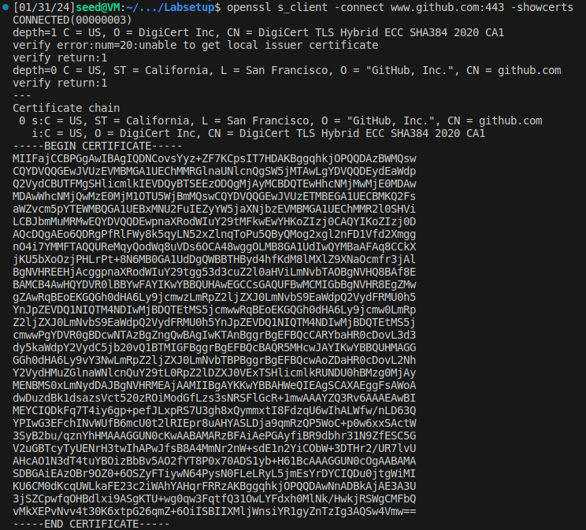

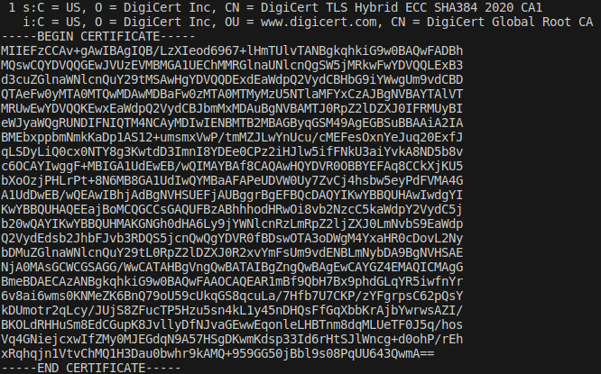

In addition, both certificates can be accessed via the paths: `task6/github_c0.pem` and `task6/github_c1.pem`, respectively.

To get the public key value pair, i.e., `e, n`, we will utilize the `openssl` command, which is `openssl x509 -in task6/github_c1.pem -noout -modulus`.
I tried to execute this command multiple times and I also searched online, but for some reasons, I kept getting the error: `Modulus=Wrong Algorithm type`, as shown in the image below:

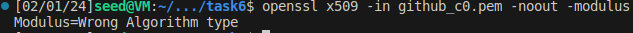

That is why, I repeated the same steps, but for `www.example.org` this time and saved its certificates inside `task6` folder under the names: `c0.pem, c1.pem`, respectively.
Now, as shown in the image below, the value of `n=CCF710624FA6BB636FED905256C56D277B7A12568AF1F4F9D6E7E18FBD95ABF260411570DB1200FA270AB557385B7DB2519371950E6A41945B351BFA7BFABBC5BE2430FE56EFC4F37D97E314F5144DCBA710F216EAAB22F031221161699026BA78D9971FE37D66AB75449573C8ACFFEF5D0A8A5943E1ACB23A0FF348FCD76B37C163DCDE46D6DB45FE7D23FD90E851071E51A35FED4946547F2C88C5F4139C97153C03E8A139DC690C32C1AF16574C9447427CA2C89C7DE6D44D54AF4299A8C104C2779CD648E4CE11E02A8099F04370CF3F766BD14C49AB245EC20D82FD46A8AB6C93CC6252427592F89AFA5E5EB2B061E51F1FB97F0998E83DFA837F4769A1`, and the value of `e=10001`.

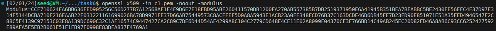

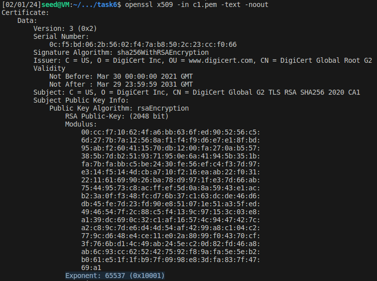

Now, we will get the certification authoroties signature on `www.example.org` certificate which resides in `c0.pem` file.
Because the output is huge, I cannot attach an image that shows both the command and CA's signature.
So, the command is: `openssl x509 -in c0.pem -text -noout` and output CA's signature (part of the command's execution output) is shown in the image below.

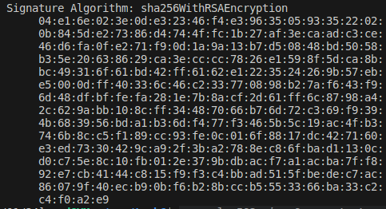

Since we want the hex value without colons and spaces, we will save the output signature to a file `task6/ca-signature` and use the command: `cat ca-signature | tr -d '[:space:]:'` to achieve this task, as shown in the screenshot below.
The output signature is: `04e16e023e0de32346f4e3963505933522020b845de27386d4744ffc1b27af3ecaadc3ce46d6fa0fe271f90d1a9a13b7d50848bd5058b35e20638629ca3ecccc7826e1598f5dca8bbc49316f61bd42ff6162e1223524269b57ebe5000dff40336c46c233770898b27af643f96d48dfbffefa281e7b8acf2d61ff6c8798a42c629abb108cff34487066b76d72c369f9394b683956bda1b36df477f3465b5c19ac4fb3746b8cc5f189cc93fe0c016f8817dc427160e3ed7330429ca92f3ba2788ec86fbad1130cd0c75e8c10fb012e379bdbacf7a1acba7ff892e7cb4144c815f9f3c4bbad515fbedec7ac86079f40ecb90bf6b28bccb5553366ba33c2c4f0a2e9`

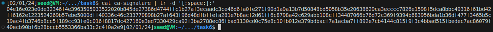

The signature is calculated on the hash of the whole body of the certificate.
To extract the body of the certificate without the signature itself, we will run the following command: `openssl asn1parse -i -in c0.pem -strparse 4 -out c0_body.bin -noout`, which generates the binary file: `task6/c0_body.bin` that contains only the body of the server's certificate.
Note, this file cannot be viewed (not human readable), since it is a binary file.
Now, lets calculate the hash of the certificate using the command: `sha256sum c0_body.bin` or the command `openssl dgst -sha256 c0_body.bin`, as shown in the screenshot below.
The output hash is: `b2825cb7d71ec7093e7ff7026c562a29122de3b4900ed13dad63d1be73706e0d`.

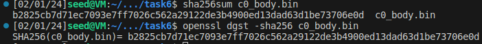

Now, lets use our verification code `task6.c` to verify the server's signature on the hash of the body of the certificate.
For summarization purposes, I will copy here all the important values from this document that will be needed during the running of the signature verification, because those are the values that you will find us use in the file `task6.c`:

- n = `CCF710624FA6BB636FED905256C56D277B7A12568AF1F4F9D6E7E18FBD95ABF260411570DB1200FA270AB557385B7DB2519371950E6A41945B351BFA7BFABBC5BE2430FE56EFC4F37D97E314F5144DCBA710F216EAAB22F031221161699026BA78D9971FE37D66AB75449573C8ACFFEF5D0A8A5943E1ACB23A0FF348FCD76B37C163DCDE46D6DB45FE7D23FD90E851071E51A35FED4946547F2C88C5F4139C97153C03E8A139DC690C32C1AF16574C9447427CA2C89C7DE6D44D54AF4299A8C104C2779CD648E4CE11E02A8099F04370CF3F766BD14C49AB245EC20D82FD46A8AB6C93CC6252427592F89AFA5E5EB2B061E51F1FB97F0998E83DFA837F4769A1`
- e = `10001`
- Hash of the certificate's body: `b2825cb7d71ec7093e7ff7026c562a29122de3b4900ed13dad63d1be73706e0d`
- CA's signature: `04e16e023e0de32346f4e3963505933522020b845de27386d4744ffc1b27af3ecaadc3ce46d6fa0fe271f90d1a9a13b7d50848bd5058b35e20638629ca3ecccc7826e1598f5dca8bbc49316f61bd42ff6162e1223524269b57ebe5000dff40336c46c233770898b27af643f96d48dfbffefa281e7b8acf2d61ff6c8798a42c629abb108cff34487066b76d72c369f9394b683956bda1b36df477f3465b5c19ac4fb3746b8cc5f189cc93fe0c016f8817dc427160e3ed7330429ca92f3ba2788ec86fbad1130cd0c75e8c10fb012e379bdbacf7a1acba7ff892e7cb4144c815f9f3c4bbad515fbedec7ac86079f40ecb90bf6b28bccb5553366ba33c2c4f0a2e9`

The next screenshot shows the output of running `task6.c` file and that the signature is verified at the end.
Two important notes to consider.
First, after a close observation of the next screenshot, it will show that the generated hash of the body after decrypting the signature using the public key of the CA as shown in line 39 in `task6.c` file, its output is similar to the hash of the body of the certificate, but it is padded in the beginning with lots of ones.
That is why, we need to truncate it using this instruction: `BN_mask_bits(generated_M, 265);`.

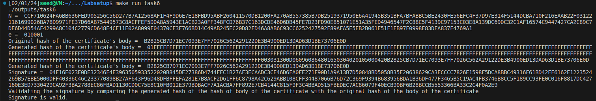

Second, all the inputs: n, e, hash of the certificate's body, and CA's signature, are given as input to the program `task6.c` from lines 28 to 32.
The explanation for each variable is shown in the definition of each variable.
This can be checked from the following image.

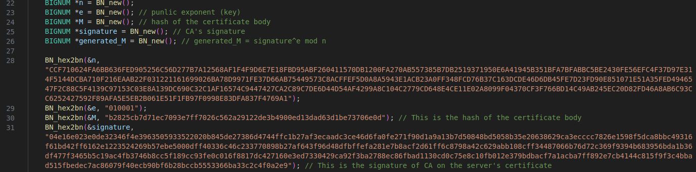
